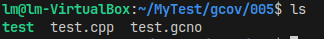
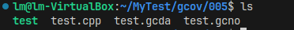
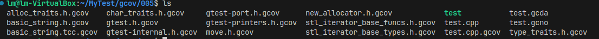

# Gcovr使用

### 编译待测试文件
```sh
g++ test.cpp -o test -lgtest -lpthread --coverage 
```


`test.cpp`是待测试文件
`test`是生成的可执行文件
`test.gcno`是gcovr生成的文件

### 运行可执行文件
```sh
./test
```
产生`.gcda`文件


### 根据gcda文件生成gcov文件
```sh
gcov test.cpp
```


### 生成图形化显示数据
```sh
lcov -c -d . -o test.info --rc lcov_branch_coverage=1
```

### 去除不需要的文件
```sh
lcov --remove ./test.info '/usr/*' -o ./test.info
```

### 生成html格式的覆盖率报告
```sh
genhtml -o result test.info
```

### 浏览器中打开报告
```sh
firefox ./result/index.html
```
