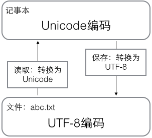
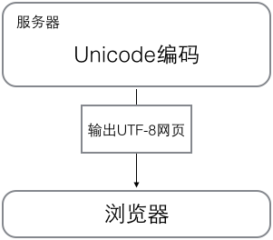

# 字符串与编码

---

### 三种编码格式
1. ASCII
   1个字节 8比特 最多255种
2. Unicode
   2个字节 16比特 最多65535种
3. UTF-8
   可变长编码 常用英文字母1个字节 汉字通常3个字节 生僻字4-6个字节

### 计算机通用字符编码工作方式
计算机内存中统一使用Unicode 需要保存到应盘或传输时转为UTF-8
- 用记事本编辑的时候，从文件读取的UTF-8字符被转换为Unicode字符到内存里，编辑完成后，保存的时候再把Unicode转换为UTF-8保存到文件

- 浏览网页的时候，服务器会把动态生成的Unicode内容转换为UTF-8再传输到浏览器


### 字符串
- 采用Unicode编码，所以支持多语言
```py
print('包含中文的字符串')
```
- 可以使用ord()获取字符的整数表示
```py
print(ord('A'))
print(ord('中'))
```
- 使用chr()把编码转换成对应的字符
```py
print(chr(55))
print(chr(333))
```
- 要在网络上传输或磁盘上储存，用b''将字符串转换成bytes
```py
x = b'ABC'
print(x)
```
区分
'ABC'是str
b'ABC'是bytes只占用一个字节

a = 'ABC'.encode('ascii')
将ABC -> b'ABC'
b = a.decode('utf-8')
将b'ABC' -> ABC

- 字符串的长度
  len()
  ```py
  print(len('ABC'))
  ```